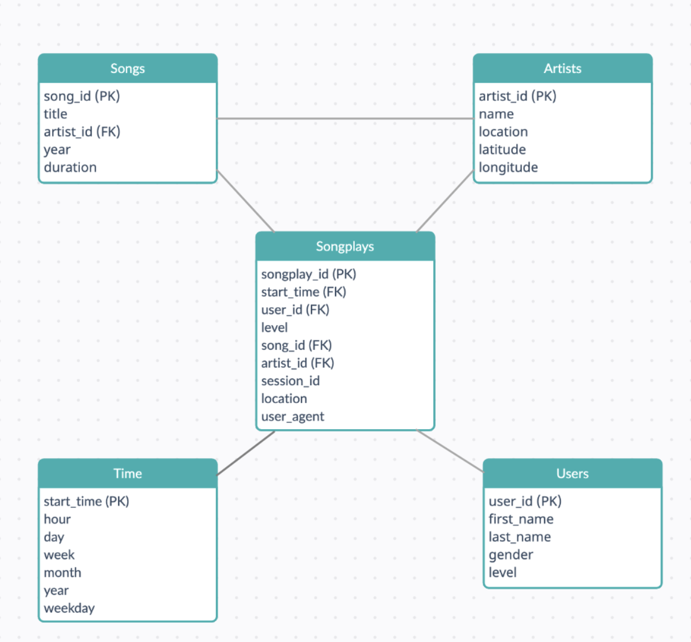

# Project: Data Warehouse

Hello! this repository provides a solution to Project 1 (**Project: Data Warehouse)** of the Data Engineering nano degree at [Udacity](https://www.udacity.com/course/data-engineer-nanodegree--nd027).

## **Project Instructions**

### P**rerequisite**

- Create an IAM role, Redshift cluster, and open a TCP connection to allow third-party applications to interact with the cluster.
- Update your credentials in `dwh.cfg`

### **Create database and tables**

- Run `python create_tables.py` to create the database and tables.

### **ETL Process**

After creating the database and tables we can start the ETL process:

- Run `python etl.py` This will extract data from all the .json files located in the `s3://udacity-dend` bucket and store it on the Redshift instance

## Dataset

### ****Song Dataset****

The first dataset is a subset of real data from the **[Million Song Dataset](http://millionsongdataset.com/).** Each file is in JSON format and contains metadata about a song and the artist of that song. Each JSON file contains information about artists and songs. The data is stored at `s3://udacity-dend/song_data`

```
song_data/A/B/C/TRABCEI128F424C983.json
song_data/A/A/B/TRAABJL12903CDCF1A.json
```

Example:

```json
{
   "num_songs":1,
   "artist_id":"ARJIE2Y1187B994AB7",
   "artist_latitude":null,
   "artist_longitude":null,
   "artist_location":"",
   "artist_name":"Line Renaud",
   "song_id":"SOUPIRU12A6D4FA1E1",
   "title":"Der Kleine Dompfaff",
   "duration":152.92036,
   "year":0
}
```

### Logs ****Dataset****

The second dataset consists of log files in JSON format generated by this **[event simulator](https://github.com/Interana/eventsim)**
based on the songs in the dataset above. The data is stored in `s3://udacity-dend/log_data` and it’s division configuration is available at `s3://udacity-dend/log_json_path.json`

```
log_data/2018/11/2018-11-12-events.json
log_data/2018/11/2018-11-13-events.json
```

Example:

```json
{
   "artist":null,
   "auth":"Logged In",
   "firstName":"Walter",
   "gender":"M",
   "itemInSession":0,
   "lastName":"Frye",
   "length":null,
   "level":"free",
   "location":"San Francisco-Oakland-Hayward, CA",
   "method":"GET",
   "page":"Home",
   "registration":1540919166796.0,
   "sessionId":38,
   "song":null,
   "status":200,
   "ts":1541105830796,
   "userAgent":"\"Mozilla\/5.0 (Macintosh; Intel Mac OS X 10_9_4) AppleWebKit\/537.36 (KHTML, like Gecko) Chrome\/36.0.1985.143 Safari\/537.36\"",
   "userId":"39"
}{
   "artist":null,
   "auth":"Logged In",
   "firstName":"Kaylee",
   "gender":"F",
   "itemInSession":0,
   "lastName":"Summers",
   "length":null,
   "level":"free",
   "location":"Phoenix-Mesa-Scottsdale, AZ",
   "method":"GET",
   "page":"Home",
   "registration":1540344794796.0,
   "sessionId":139,
   "song":null,
   "status":200,
   "ts":1541106106796,
   "userAgent":"\"Mozilla\/5.0 (Windows NT 6.1; WOW64) AppleWebKit\/537.36 (KHTML, like Gecko) Chrome\/35.0.1916.153 Safari\/537.36\"",
   "userId":"8"
}
```

## Database **Schema**

### Table StageEvent

This table stores a temporary data of events

```json
stage_events (
		auth            TEXT,
    first_name      TEXT,
    gender          TEXT,
    item_in_session INTEGER,
    last_name       TEXT,
    length          FLOAT4,
    level           TEXT,
    location        TEXT,
    method          TEXT,
    page            TEXT,
    registration    FLOAT8,
    session_id      BIGINT,
    song            TEXT,
    status          INTEGER,
    ts              BIGINT,
    user_agent      TEXT,
    user_id         TEXT
);
```

### Table StageSongs

This table stores a temporary data of songs

```
stage_songs (
    song_id             TEXT,
    title               TEXT,
    duration            FLOAT4,
    year                SMALLINT,
    artist_id           TEXT,
    artist_name         TEXT,
    artist_latitude     FLOAT4,
    artist_longitude    FLOAT4,
    artist_location     TEXT,
    num_songs           INTEGER
);
```

### **Table Artists**

```
artists(
    artist_id   TEXT PRIMARY KEY SORTKEY,
    name        TEXT NOT NULL,
    location    TEXT NOT NULL,
    latitude    FLOAT4,
    longitude   FLOAT4
) diststyle all;
```

### **Table Songs**

```
song (
    song_id     TEXT PRIMARY KEY SORTKEY,
    title       TEXT NOT NULL,
    artist_id   TEXT NOT NULL,
    year        SMALLINT NOT NULL,
    duration    FLOAT4 NOT NULL
);
```

### **Table Time**

```
time(
    start_time  TIMESTAMP PRIMARY KEY SORTKEY,
hour        SMALLINT NOT NULL,
	  day         SMALLINT NOT NULL,
	  week        SMALLINT NOT NULL,
	  month       SMALLINT NOT NULL,
	  year        SMALLINT NOT NULL,
	  weekday     SMALLINT NOT NULL
) diststyle all;
```

### **Table Users**

```
users(
  user_id      TEXT PRIMARY KEY DISTKEY,
  first_name   TEXT NOT NULL,
  last_name    TEXT NOT NULL,
  gender       CHAR(1) NOT NULL,
  level        TEXT NOT NULL
) diststyle key;
```

### **Table Songplays**

```
songplays(
    songplay_id     BIGINT IDENTITY(1, 1) PRIMARY KEY,
    start_time      TIMESTAMP NOT NULL SORTKEY,
    user_id         TEXT NOT NULL DISTKEY,
    level           TEXT NOT NULL,
    song_id         TEXT,
    artist_id       TEXT,
    session_id      BIGINT NOT NULL,
    location        TEXT NOT NULL,
    user_agent      TEXT NOT NULL
) diststyle key;
```

## **Representation of Star Schema**



### Procedure

The purpose of the project is to use the AWS tool to make a Data Warehouse. Initially, we have to create a Redshift cluster and create tables that fulfill our requirement of a star schema. While creating tables we have to apply distributions on tables using a `distkey` and a `sortkey` to improve the performance of queries. After that, we are filling our staging tables from the JSON data in the S3 bucket, for that we are using `COPY` command used for transporting data within AWS. Finally, we are inserting data into our scheme from tables on stage