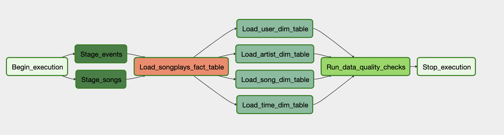
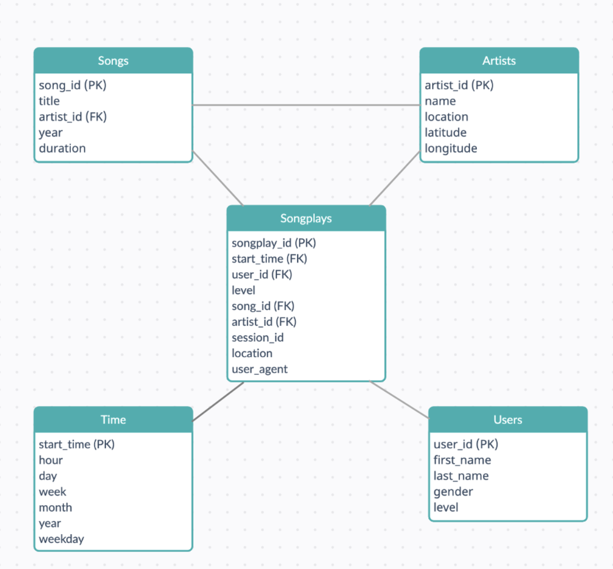

# Project: Data Pipeline

Hello! this repository provides a solution to Project (**Project: Data Pipeline)** of the Data Engineering nano degree at [Udacity](https://www.udacity.com/course/data-engineer-nanodegree--nd027)

## **Project Instructions**

### P**rerequisite**

- Create an IAM role, Redshift cluster, and make a cluster public to make it available throughout the internet
- Add `redshift` and `aws_credentials` in airflow connections

### Run Airflow

- Run `/opt/airflow/start.sh` to start the airflow

### **ETL Process**

All our processes are defined in the DAG ``. Just start a DAG and It’ll start to run tasks.

**Tasks:**

**Begin_execution:** (DummyOperator) Represents the start of the pipeline

**Drop_tables_in_redshift**: (PostgresOperator) Drop `artists`, `songplays`, `songs`, `time`, `users`, `staging_events`, and `staging_songs` tables if they exist in a redshift database.

**Create_tables_in_redshift**: (PostgresOperator) Creates `artists`, `songplays`, `songs`, `time`, `users`, `staging_events`, and `staging_songs` tables in a redshift database.

**Stage_songs**: (StageToRedshiftOperator) Copy songs data from s3 bucket to redshift `staging_songs` table

**Stage_events**: (StageToRedshiftOperator) Copy events data from s3 bucket to redshift `staging_evnets` table

**Load_songplays_fact_table**: (LoadFactOperator) Insert data from staging tables to `songplay`

table

**Load_user_dim_table**: (LoadDimensionOperator) Insert data to `user` dimension table

**Load_time_dim_table**: (LoadDimensionOperator) Insert data to `time` dimension table

**Load_song_dim_table**: (LoadDimensionOperator) Insert data to `song` dimension table

**Load_artist_dim_table**: (LoadDimensionOperator) Insert data to `artist` dimension table

**Run_data_quality_checks**: (DataQualityOperator) Run Not empty validity checks for all tables

**Stop_execution**: (DummyOperator) Represents the end of the pipeline

## **Representation of Star Schema**

