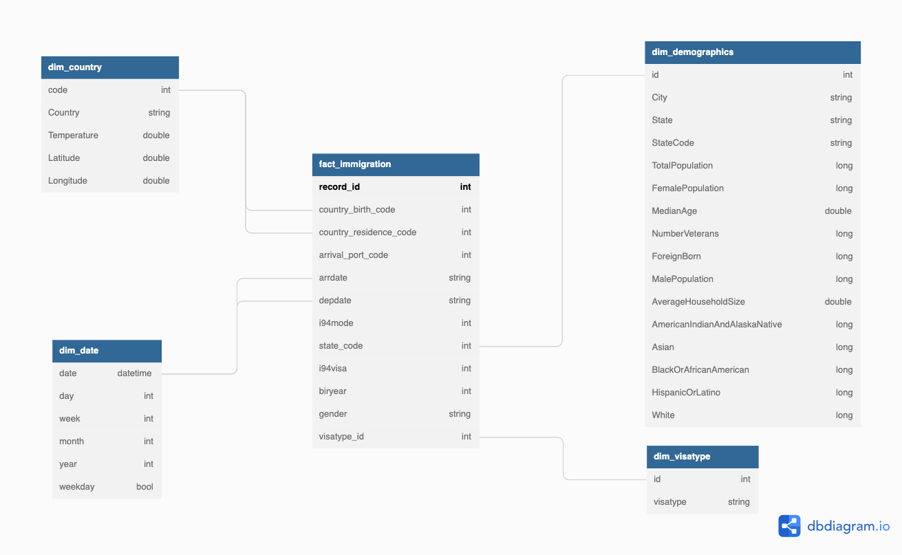

# Capstone Project

## summary

In this project, we will be looking at the immigration data for the united states. we are interested in the effects of temperature on the volume of travelers and the connection between the volume of travel and the demographics of various cities. The steps and guidelines are mentioned is a notebook

**We have combined 3 datasets to build the below start schema**

## Dataset

We are using 3 different datasets from different sources to create a ETL pipeline

[I94 Immigration Data](https://www.trade.gov/national-travel-and-tourism-office): This data comes from the US National Tourism and Trade Office.
[World Temperature Data](https://www.kaggle.com/datasets/berkeleyearth/climate-change-earth-surface-temperature-data): This dataset came from Kaggle.
[U.S. City Demographic Data](https://public.opendatasoft.com/explore/dataset/us-cities-demographics/export/): This data comes from OpenSoft.

## **Project Instructions**

### ETL Pipeline

- Run `python etl.py` to run the pipeline
- Optional: Run `Capstone Project Submission`  Juppyter notebook to get inside of the data pipeline